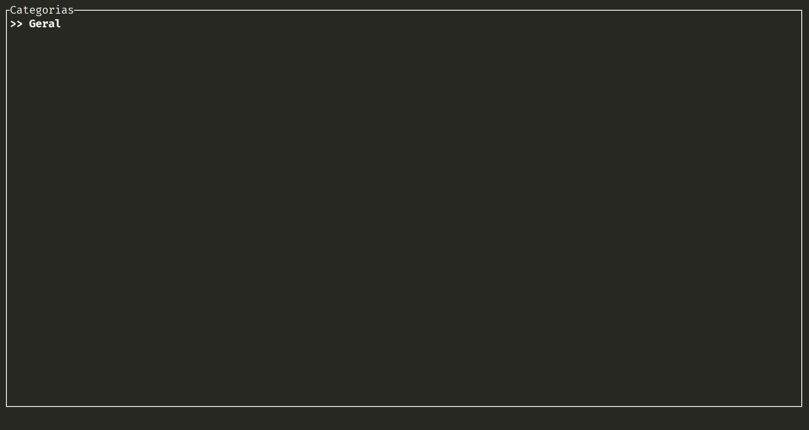
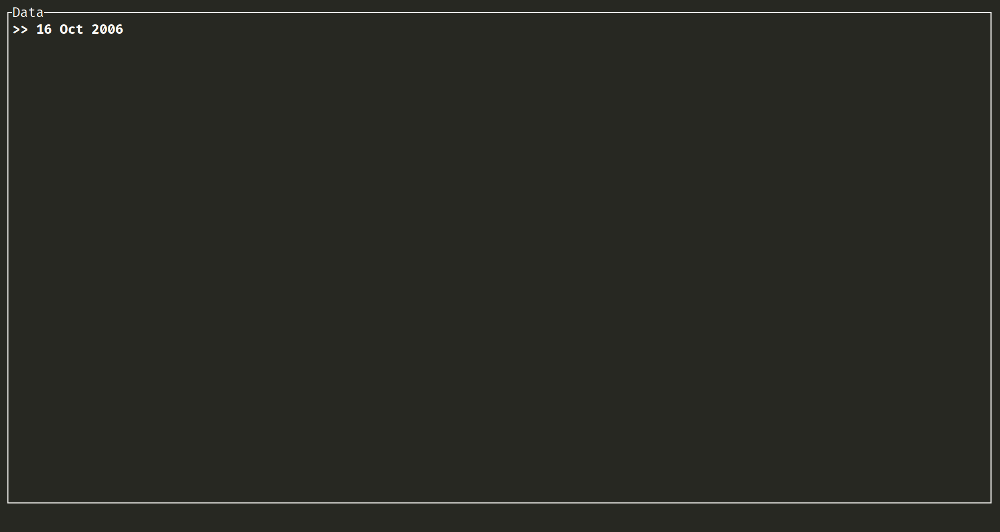
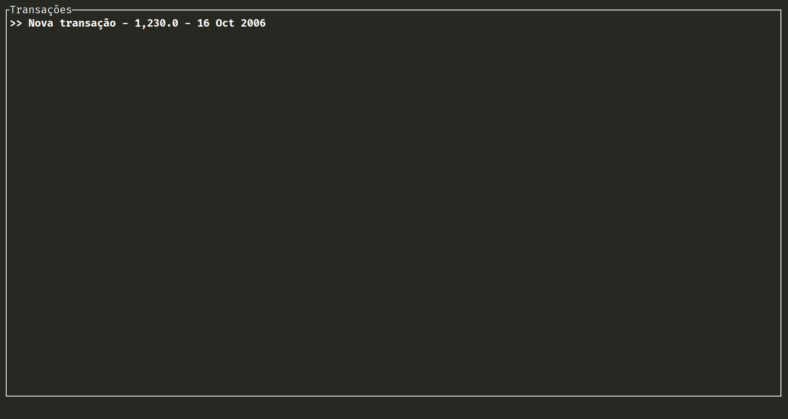
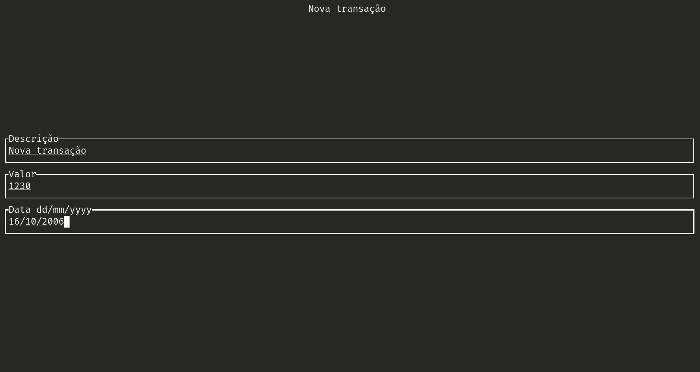

# Budget Manager Rs
Gerenciador de financias feito em Rust usando Ratatui e SQLite.

Execute usando o cargo :
```bash
cargo run -q --release
```

Ou construa o binário:
```bash
cargo build --release
```

## Controles
### Em Listas
- <b>Control + A</b> - Adicionar (Transação ou Categoria)
- <b>Control + D</b> - Deletar (Transação, Categoria, ou Data)
- <b>Control + F</b> - Pesquisar (Transação, Categoria, ou Data)
- <b>Control + L</b> - Limpar pesquisa
- <b>Control + C</b> - Mudar Categoria (Data ou Transação)
- <b>Tecla de Espaço</b> - Marcar seleção
- <b>Escape/Esc</b> - Voltar para tela anterior

### Ao adicionar
- <b>Escape/Esc</b> - Cancelar nova Transação/Categoria
- <b>Enter</b> - Confirmar nova Transação/Categoria

### Ao pesquisar
- <b>Escape/Esc</b> - Cancelar pesquisa
- <b>Enter</b> - Confirmar pesquisa


## Preview
### Lista de categorias


### Lista de Datas


### Lista de Transações


### Nova transação


# Dependencias

- [chrono](https://crates.io/crates/chrono) -  Date and time library for Rust 
- [crossterm](https://crates.io/crates/crossterm) -  A crossplatform terminal library for manipulating terminals. 
- [numfmt](https://crates.io/crates/numfmt) -  Fast and friendly Rust number formatting 
- [ratatui](https://crates.io/crates/ratatui) -  A library that's all about cooking up terminal user interfaces 
- [rusqlite](https://crates.io/crates/rusqlite) -  Ergonomic wrapper for SQLite 
- [simple-home-dir](https://crates.io/crates/simple-home-dir) -  Efficiently retrieve the user's home directory. 
- [tui-textarea](https://crates.io/crates/tui-textarea) -  tui-textarea is a simple yet powerful text editor widget for ratatui and tui-rs. Multi-line text editor can be easily put as part of your TUI application. 
